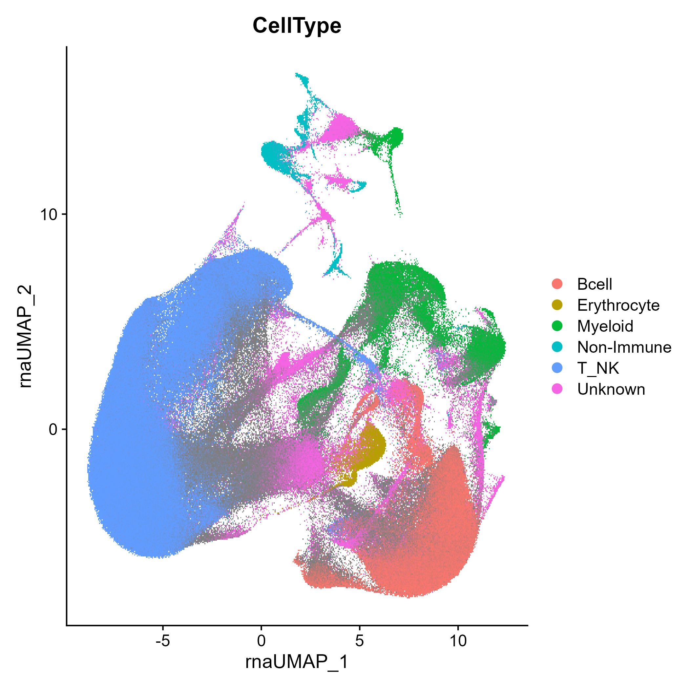
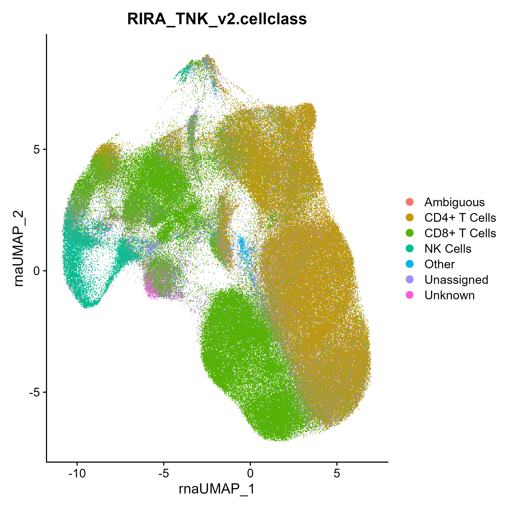
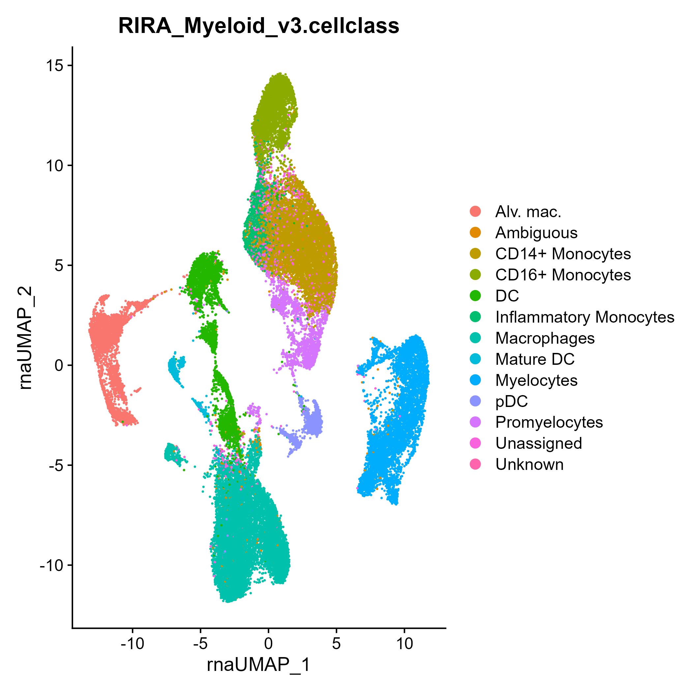

This vignette provides examples on how to use the rhesus macaque cell type scoring models generated and provided by RIRA. RIRA's data was generated and labeled using the following process:

1) Merge data from all animals (n=47). Perform strict QC and filtration, based on metrics such as per-cell RNA saturation
2) For initial phenotyping, we used scGate with a set of rhesus-adapted gates to divide cells. This initial pass is lossy, and will not label all cells.
3) Cells labeled by scGate were downsampled to equalize cells per class, and then fed as training data to celltypist. The resulting model is available through this R package (see below)
4) This CellTypist model will classify cells into coarse bins (T/NK, Bcell, Myeloid, and Other). For many analyses we find it useful to subdivide a dataset into these categories and then perform dimensionality reduction on these more homogenous subsets.

```{r setup, eval=FALSE}

library(RIRA)
library(Seurat)
library(ggplot2)
library(patchwork)

```
First download the data as a Seurat object (or use your own input data):

```{r download, eval=FALSE}
seuratObj <- DownloadFromGEO(subset = 'All', outfile = 'RIRA_All.rds.gz')
```

Use the built-in celltypist model to score cells according to coarse cell types (T/NK, Bcell, Myeloid, Other). The rationale for selecting this level of classification is that these should be mutually exclusive cell types and these cell types should robustly separate (i.e., other factors that impact cell state should not cause collisions). After the initial classification, it will also score cells for a panel of UCell markers designed to identify incompatible cell types, such as T/NK cells and Erythrocytes), which likely indicate doublets. See FilterDisallowedClasses() for more detail.

```{r classify, eval=FALSE}

seuratObj <- RIRA::Classify_ImmuneCells(seuratObj)
Seurat::DimPlot(seuratObj, group.by = 'RIRA_Immune_v2.cellclass')

```

```{r, echo=FALSE, fig.width=5, fig.alt = 'UMAP plot of bulk immune colored based on cell type label'}

```

We also provide two specialist models designed for sub-typing within T/NK cells and within Myeloid cells. While in our experience these models are useful for automatic cell type/subtype scoring, it is important to note that these are not perfect, and there are predictable biological processes that cause cells of different lineages to have highly similar transcriptomes (e.g., a highly cytotoxic T cell and an NK cell, or highly cytotoxic TEM-like CD4+ T cells and cytotoxic CD8+ T cells). These issues are explored in more detail in the RIRA manuscript.

```{r tnk, eval=FALSE}

seuratObj <- DownloadFromGEO(subset = 'T_NK', outfile = 'RIRA_TNK.rds.gz')
seuratObj <- RIRA::Classify_TNK(seuratObj)
Seurat::DimPlot(seuratObj, group.by = 'RIRA_TNK_v2.cellclass')
```

```{r, echo=FALSE, fig.width=4, fig.alt = 'UMAP plot of T/NK cells colored based on cell subtype label'}

```

```{r myeloid, eval=FALSE}
seuratObj <- DownloadFromGEO(subset = 'Myeloid', outfile = 'RIRA_Myeloid.rds.gz')
seuratObj <- RIRA::Classify_Myeloid(seuratObj)
Seurat::DimPlot(seuratObj, group.by = 'RIRA_Myeloid_v3.cellclass')
```

```{r, echo=FALSE, fig.width=4, fig.alt = 'UMAP plot of myeloid cells colored based on cell subtype label'}

```