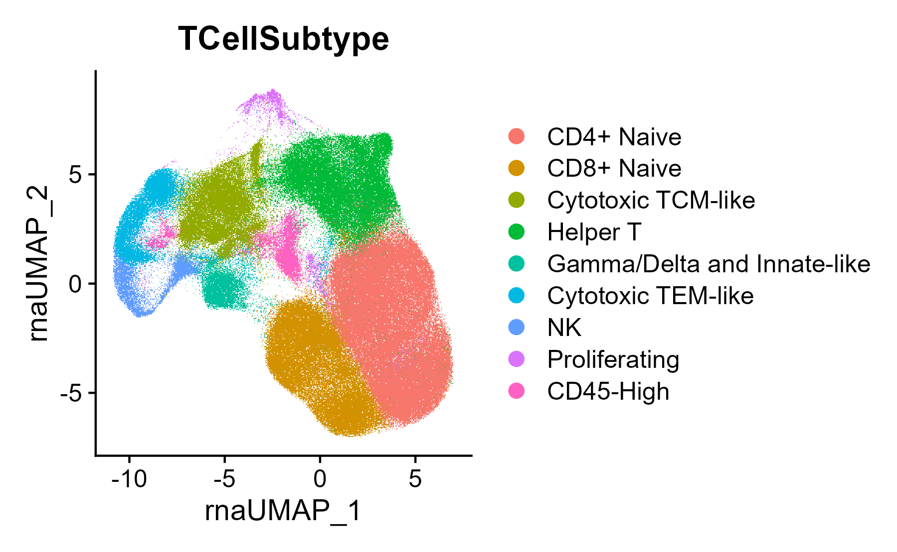
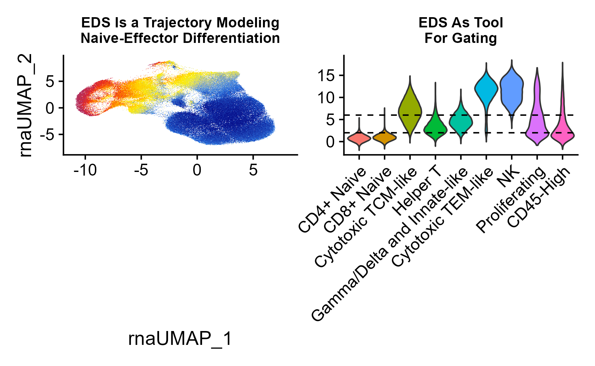
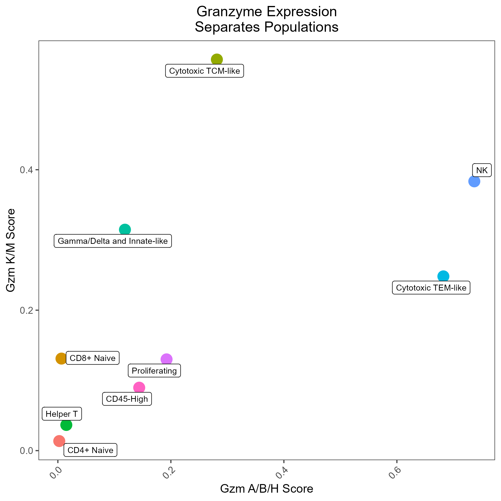

This vignette provides examples on how to use the rhesus macaque cell type scoring models generated and provided by RIRA. RIRA's data was generated and labeled using the following process

```{r setup, eval=FALSE}

library(RIRA)
library(Seurat)
library(ggplot2)
library(patchwork)

```

# Getting Started

First download the data as a Seurat object (or use your own input data):

```{r download, eval=FALSE}
seuratObj <- DownloadFromGEO(subset = 'T_NK', outfile = 'RIRA_T_NK.rds')
```

These are the cell labels used in the RIRA manuscript, also provided in the seurat object:

```{r classify, eval=FALSE}
Seurat::DimPlot(seuratObj, group.by = 'TCellSubtype')

```

```{r, echo=FALSE, fig.width=5, fig.alt='UMAP plot of T and NK cells colored based on subtype label'}

```

# Modeling T Cell Naive-Effector Differentiation

Using sorted T cell data, we empirically defined a trajectory (gene component) that models T cell naive-to-memory differentiation, which can be used to categorize cells according to this property. This can be imputed into any seurat object, following the example below.

A practical usage of this score could be to subset/gate a dataset

```{r eds, eval=FALSE}

seuratObj <- ScoreUsingSavedComponent(seuratObj, componentOrName = 'Tcell_EffectorDifferentiation', fieldName = 'EDS')

UMAP_ED <- FeaturePlot(seuratObj, features = 'Tcell_EffectorDifferentiation', min.cutoff = 'q02', max.cutoff = 'q98') +
        ggtitle('EDS Is a Trajectory Modeling\nNaive-Effector Differentiation') +
        scale_color_gradientn(
                colors = c("navy", "dodgerblue", "yellow", "gold", "orange", "red", "maroon")
        ) +
        NoLegend()

Pheno <- VlnPlot(seuratObj, features = 'Tcell_EffectorDifferentiation', group.by = 'TCellSubtype', pt.size = 0) + NoLegend() + ggtitle('EDS As Tool\nFor Gating') +
        geom_hline(yintercept = 6, linetype = 'dashed') +
        geom_hline(yintercept = 2, linetype = 'dashed') +
        labs(x = '')

P <- UMAP_ED + Pheno + patchwork::plot_layout(ncol = 2)
P

```

```{r, echo=FALSE, fig.alt='UMAP plot of T and NK cells colored based on Effector-Differentiation Score'}

```

# Memory and Cytotoxic Differentiation

As might be predicted, the RNA features that are most robust at distinguishing lineage/state are not always identical to the canonical protein markers.
In the RIRA manuscript, we demonstrated the expression of S100A proteins was correlated with naive-memory differentiation, and that the pattern of granzyme expression was also correlated with differentiation, with T-central memory cells being skewed toward granzymes K/M, and T effector memory being skewed toward granzymes B/H.

The code below demonstrate

```{r ucell, eval=FALSE}

seuratObj <- UCell::AddModuleScore_UCell(seuratObj, features = list(
        TCellMemory = GetGeneSet('TCellMemoryS100'),
        Cytotoxicity.GzmABH = GetGeneSet('Cytotoxicity.GzmABH'),
        Cytotoxicity.GzmKM = GetGeneSet('Cytotoxicity.GzmKM')
  ))

dat <- seuratObj@meta.data %>%
        group_by(TCellSubtype) %>%
        summarize(
                Cytotoxicity.GzmKM_UCell = mean(Cytotoxicity.GzmKM_UCell),
                Cytotoxicity.GzmABH_UCell = mean(Cytotoxicity.GzmABH_UCell)
        )

GZM_Plot <- ggplot(dat, aes(x = Cytotoxicity.GzmABH_UCell, y = Cytotoxicity.GzmKM_UCell, color = TCellSubtype)) +
        geom_point(size = 5) +
        ggrepel::geom_label_repel(aes(label = TCellSubtype), color = 'black', size = 3, max.overlaps = 3) +
        egg::theme_article(base_size = 12) +
        theme(
                legend.position = 'none',
                plot.title = element_text(hjust = 0.5),
                axis.text.x = element_text(angle = 45, hjust = 1)
        ) +
        labs(
                title = 'Granzyme Expression\nSeparates Populations',
                x = 'Avg. Gzm A/B/H Score',
                y = 'Avg. Gzm K/M Score'
        )

```

```{r, echo=FALSE, fig.alt='UMAP plot of T and NK cells colored based on Effector-Differentiation Score'}

```